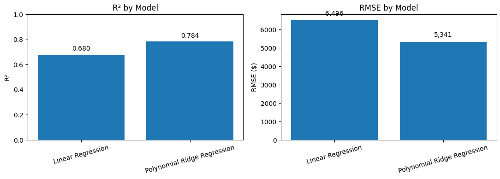
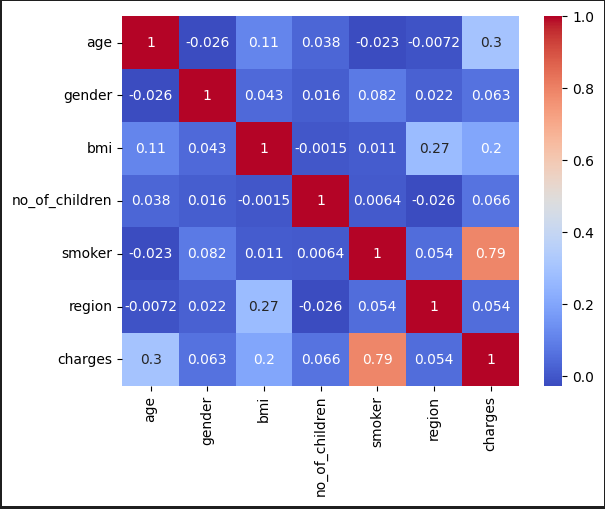
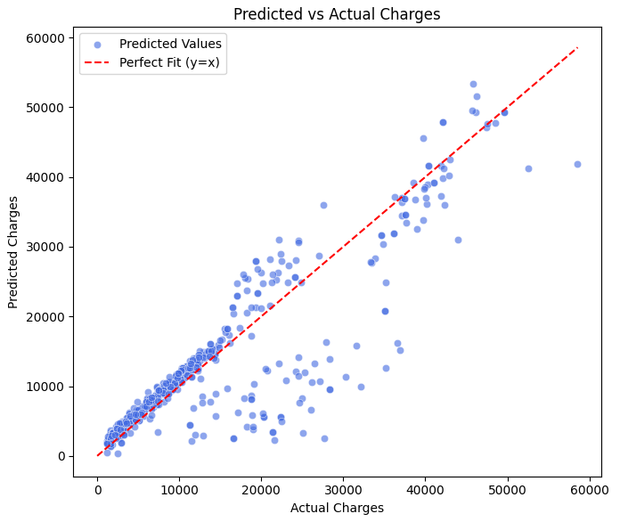
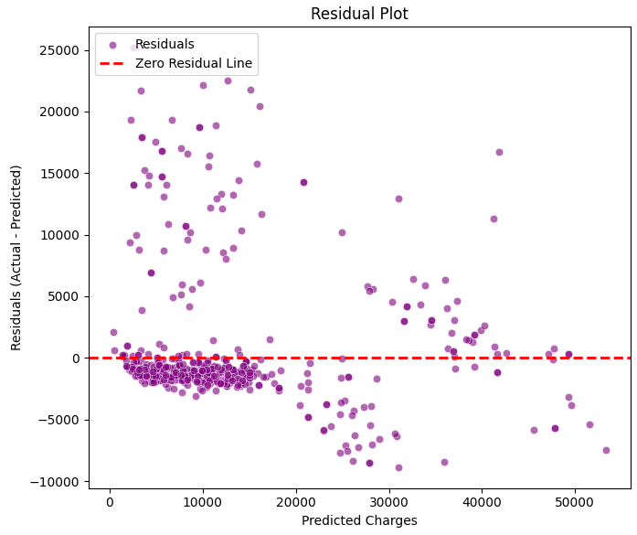

# 🩺 Insurance Cost Analysis — Predicting Medical Charges

A concise, end-to-end regression project that predicts individual medical insurance charges and explains *why*. It highlights clean EDA, reproducible modeling, and clear business takeaways.

---

## Key Results
- **Best Model:** Polynomial Ridge Regression  
- **R²:** **0.784** (≈78% variance explained)  
- **MAE:** **$3,077** │ **RMSE:** **$5,341**  
- **Behavior:** Model **overpredicts low-cost** patients and **underpredicts high-cost** patients; error variance increases with charges (**heteroskedasticity**).

| Model                       | R²   | MAE     | RMSE    |
|----------------------------|------|---------|---------|
| Linear Regression          | 0.680| $4,407  | $6,496  |
| Polynomial Ridge Regression| 0.784| **$3,077** | **$5,341** |

<p align="center">
  
</p>

---

## What drives cost
- **Smoking** is the strongest driver of higher charges; **age** is moderate; **BMI** shows non-linear effects.
- EDA (correlation heatmap, boxplots, regplots) supports the learned relationships.

<p align="center">
  
</p>

---

## Modeling approach
- **Baseline:** Linear Regression (single & multiple)
- **Refinement:** Polynomial Features + **Ridge** (captures curvature while controlling overfit)
- **Evaluation:** R², MAE, RMSE + **Predicted vs Actual** and **Residual** diagnostics

<p align="center">
  
  
</p>

**Interpretation:** Good global fit with systematic patterns at the extremes. For deployment, this model covers the **general population**, while **high-risk outliers** merit a specialized component (e.g., log-target variant, interaction features like `smoker × BMI`, or a tree-based ensemble for tails).

---

## Repo structure
```
insurance-cost-analysis/
├─ notebooks/
│  └─ Insurance_Cost_Analysis.ipynb
├─ visuals/
│  ├─ correlation_heatmap.png
│  ├─ predicted_vs_actual.png
│  ├─ residual_plot.png
│  └─ model_comparison.png
├─ data/
│  └─ medical_insurance_dataset.csv   (or link in README if not included)
├─ README.md
└─ requirements.txt
```

---

## Quickstart
```bash
# 1) create env
python -m venv .venv && source .venv/bin/activate   # on Windows: .venv\Scripts\activate

# 2) install
pip install -r requirements.txt

# 3) run the notebook
jupyter notebook notebooks/Insurance_Cost_Analysis.ipynb
```

> **Note:** The notebook expects the CSV at `data/medical_insurance_dataset.csv`.  
> If you’re using a public dataset, place it there or update the path in the first cell.

---

## Next steps
- Add **interaction terms** (`smoker × BMI`, `age × BMI`) and a **log-charges** variant to stabilize variance.  
- Compare **ElasticNet / Gradient Boosting** for high-cost calibration.  
- Ship a **Streamlit** demo for interactive predictions.

---

**Author:** Allen Stalcup  
**Role Target:** Data Analyst / ML-adjacent Analyst (remote, async)
